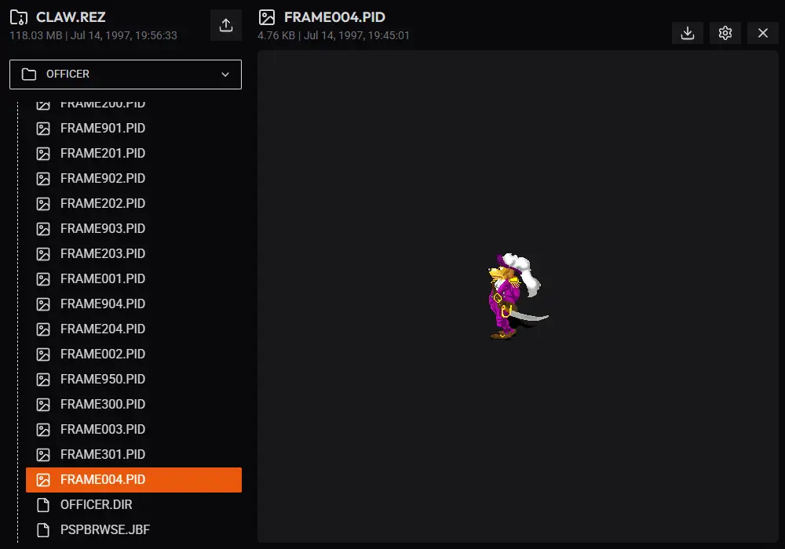

Modern browser based tool for exploring resource files (.rez) from classic Monolith Productions games built on the Windows Animation Package 32 (WAP32) engine such as Captain Claw, Gruntz, or Get Medieval.



### 📦 Supported formats

Not all file formats are supported yet. The goal is to eventually support previewing all listed formats.

**Image formats:**  
🔴 **`.PNG`** - Standard image format with transparency support.  
🔴 **`.JPEG`** - Standard image format without transparency support.  
🔴 **`.WEBP`** - Modern web image format with transparency support.  
🔴 **`.PCX`** - Old palette based image format.  
🟢 **`.PID`** - Proprietary format used in WAP32 engine storing compressed palette based image.  
🔴 **`.RID`** - Proprietary format used in WAP32 engine storing uncompressed palette based image.  
🟡 **`.PAL`** - Old color palette format used with PCX, PID and RID files.

**Audio formats:**  
🔴 **`.XMI`** - Old MIDI-like audio format.  
🟢 **`.WAV`** - Standard audio format.

**Data formats:**  
🟢 **`.TXT`** - Simple text format.  
🔴 **`.ANI`** - Proprietary format used in WAP32 engine storing animation data.  
🔴 **`.WWD`** - Proprietary format used in WAP32 engine storing game level data.

**Unknown formats found in original resource files:**  
🔴 **`.ACO`**  
🔴 **`.AHU`**  
🔴 **`.APF`**  
🔴 **`.CLT`**  
🔴 **`.DIR`**  
🔴 **`.IFC`**  
🔴 **`.JBF`**  
🔴 **`.PIC`**

**Legend:**  
🟢 Fully supported 🟡 Partial/limited support 🔴 Not supported yet

## 🛠️ Installation

### 1. Prerequirements

This project heavily relies on [fizary/hexcod](https://github.com/fizary/hexcod) and [fizary/wap32](https://github.com/fizary/wap32) packages that are not published and require manual installation.
Please follow first step of installation process from those packages first.

Above packages and this project should be colocated in same parent directory (eg. projects/hexcod, projects/wap32 and projects/wap32-viewer).

### 2. Clone and compile source

```bash
# Clone repository
git clone https://github.com/fizary/wap32-viewer.git
cd wap32-viewer

# READ PREREQUIREMENTS BEFORE INSTALLING DEPENDENCIES
# Install dependencies
npm i

# Compile source code
npm run build
```

## 💻 Preview

> ⚠️ This project does not include original resource files (.rez) due to copyright restrictions. You will need to provide your own.

When the build finishes, you can run the preview server with the following command and navigate to it in any modern browser.

```bash
npm run preview
```
